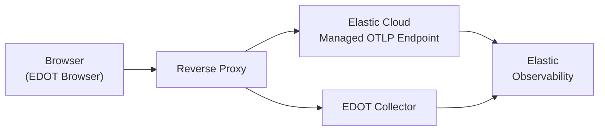

# Set up EDOT Browser

This guide shows you how to set up the {{edot}} Browser (EDOT Browser) in a web application and export browser telemetry to {{product.observability}}.

EDOT Browser runs directly in users' browsers. To send data securely without exposing secrets, use a reverse proxy. When your OTLP endpoint is available ({{ecloud}} managed OTLP or an EDOT Collector), do the following:

- [Install the agent](install-agent.md): Add EDOT Browser to your application (package or bundle) and initialize it.
- [Configure proxy and CORS](proxy-cors.md): Set up a reverse proxy in front of your OTLP endpoint and configure CORS so the browser can export telemetry securely.

:::{note}
Do not run EDOT Browser alongside another {{product.apm}} or RUM agent (including classic Elastic {{product.apm}} browser agents). Multiple agents can cause conflicting instrumentation, duplicate telemetry, or unexpected behavior.
:::

## Prerequisites [prerequisites]

Before you set up EDOT Browser, you need:

- An {{product.observability}} deployment ({{ecloud}} or self-managed)
- An OTLP ingest endpoint ({{ecloud}} Managed OTLP or an EDOT Collector)

## How browser telemetry is exported [how-browser-telemetry-is-exported]

EDOT Browser exports telemetry using the OpenTelemetry Protocol (OTLP) over HTTP. Data flows as follows (assuming you set up the proxy as recommended):

The browser sends OTLP data to the reverse proxy endpoint that you configure. The reverse proxy then forwards data either to the {{ecloud}} Managed OTLP endpoint or to an EDOT Collector, depending on your chosen ingest path.

## What to expect in {{kib}} [what-to-expect-in-kibana]

After EDOT Browser is sending telemetry to {{product.observability}}, your browser app surfaces in the following {{kib}} experiences:

- **{{product.apm}} Service Inventory**: Your browser app appears as a service.
- **{{product.apm}} trace view**: Distributed traces including browser spans are visible.
- **Service Maps**: Frontend-to-backend service dependencies are shown.
- **Discover**: Traces, metrics, and (when configured) logs are indexed and queryable.

Logs are only present in **Discover** if your application uses the OpenTelemetry Logs API to emit them. Refer to [Logs](telemetry.md#logs) for more information on what EDOT Browser emits and how to configure log export.

The **User Experience** app currently shows only data from classic Elastic {{product.apm}} Browser agents and does not display EDOT Browser data. For RUM-style dashboards compatible with EDOT Browser, install the [RUM OpenTelemetry Assets](https://github.com/elastic/integrations/tree/main/packages/otel_rum_dashboards) integration from the {{kib}} Integrations catalog. The integration is currently in preview, requires {{kib}} 9.2.1 or later, and on the Integrations page you must turn on **Display beta integrations** to find it.

The rest of this section describes what you see in those views and how to interpret it.

### Document load spans [document-load-spans]

EDOT Browser measures how long it takes a user's browser to fully load the initial HTML document served by your web server by creating document load spans. It also generates spans to measure the download time of additional resources (such as JavaScript, CSS, fonts, and images) referenced by the initial document.

In the trace view, the `documentLoad` span appears as the root span, with resource spans as its children.

### Spans from browser fetch and XHR [spans-from-fetch-xhr]

Outgoing HTTP requests made with the browser `fetch` API or `XMLHttpRequest` are captured as `external.http` spans. Each request to your backend APIs or third-party domains appears as an `external.http` span with attributes such as URL, HTTP method, and status code. These spans represent the client-side portion of the request (time in the browser) and, when your backend is instrumented with EDOT, link to the corresponding server-side trace using the trace context (trace ID and span ID) propagated in HTTP headers. In the trace view, you see the browser's `external.http` span as part of the same trace as the backend service spans when propagation is correctly configured.

### User interaction spans and grouping [user-interaction-spans]

EDOT Browser creates user interaction spans for events such as "click" and "submit". These spans represent the user action that triggered subsequent work (for example, a button click that leads to a `fetch` call). In {{kib}}, user interaction spans are used to group related spans: the interaction span is the logical parent or anchor for the cascade of operations that follow (for example, `external.http` requests and any child spans). When you analyze a trace, look for the user interaction span (for example, `userinteraction` or similar) to understand which click or submit caused the associated network and backend activity. This grouping makes it easier to attribute frontend and backend work to specific user actions.

### End-to-end trace propagation [end-to-end-trace-propagation]

Frontend-to-backend trace continuity depends on W3C Trace Context (`traceparent` and `tracestate`) headers being propagated from the browser request to the backend service. When propagation is configured correctly:

- In the **{{product.apm}} trace view**, the browser's `external.http` span and the backend service spans appear in the same waterfall, so you can follow a request from the user action through the frontend to backend services.
- In **Discover**, you can filter by `trace.id` (or by the frontend `service.name`) to retrieve every document that belongs to the same trace, including both browser-originated and backend spans.
- In **Service Maps**, the browser `external.http` span's destination is matched to a backend service that is also instrumented and reported to {{product.observability}}, producing the dependency edge between the frontend and that service.

If trace context is not propagated, browser and backend spans appear as separate traces, and no dependency edge is drawn between them in Service Maps.

## Next steps [next-steps]

After completing setup:

- Refer to [Install the agent](install-agent.md) and [Proxy and CORS](proxy-cors.md) for installation and proxy configuration.
- Refer to [Configure EDOT Browser](configuration.md) to customize behavior and defaults.
- Refer to [Metrics, traces, and logs](telemetry.md) for what is emitted for each signal and known limitations.
- Review [Supported technologies](supported-technologies.md) for information about browsers, bundlers, and instrumentations.
- If telemetry doesn't appear, refer to [Troubleshooting](troubleshooting.md).
